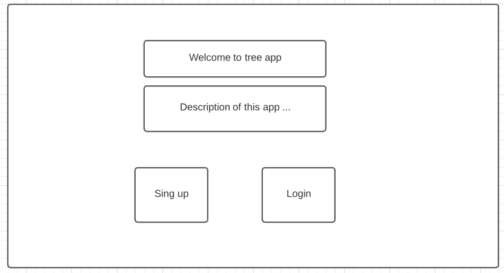
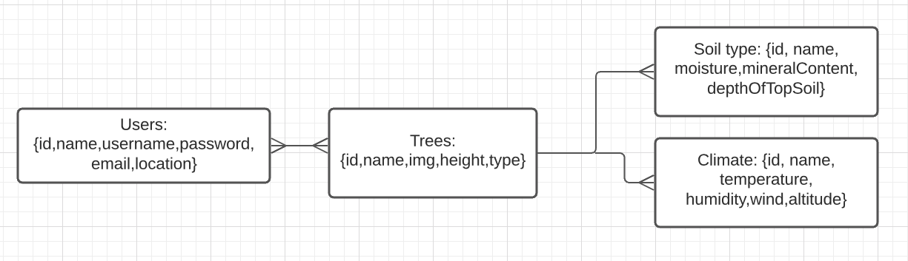

# Project Two: Tree club app

* Team Members: Tom and Hermilo

## App idea

An app to help you choose the rigth tree for your garden.

## Technologies employed

* Node.js
* Postgres
* Express
* EJS
* Heroku

## Planing and approach taken

* Brainstorm for the app idea
    + Pets
    + Tourist
    + Gardening
        - Trees
    + Tea
    + Birds
    + Tools
* Wireframe and define databases and their relationships

* Build the app basic strcuture using pair programing
    + Driver: Tom
    + Navigator: Hermilo
* After that, split the jog in specific tasks. For example: documentation, styling, etc

## User stories

## Unsolved problems

## Link to the app